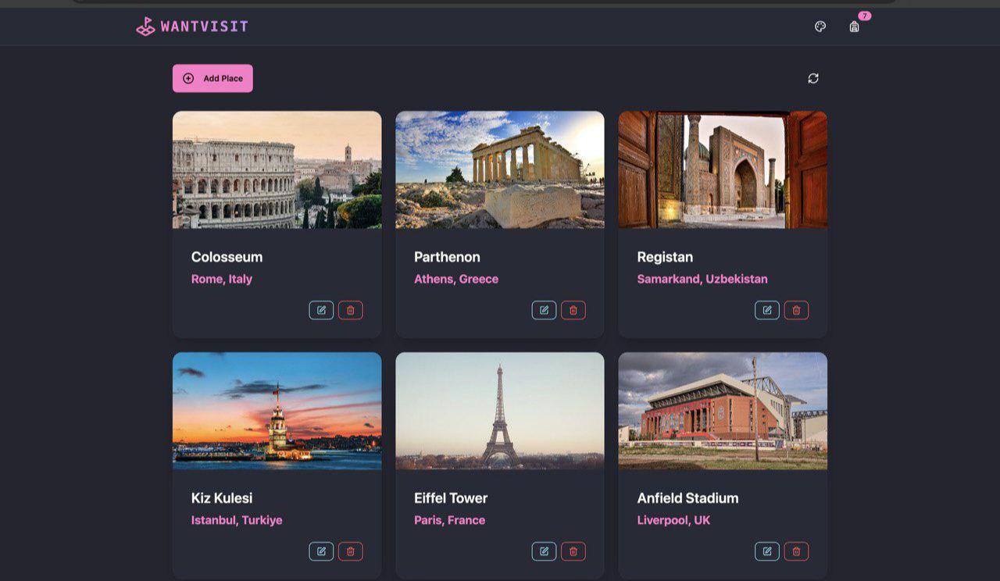

## 🎥 Demo

Check out the live version of WantVisit? here:  
🔗 **[Live Demo](https://wantvisit.onrender.com/)**



## 🌍 Overview

WantVisit is a web application built using the **PERN stack** that allows users to add places with their name, country, and image. The goal is to create an interactive platform where users can share and explore interesting locations worldwide.

## 🚀 Features

- 🌟 **Tech Stack**: PERN (PostgreSQL, Express, React, Node.js) + TailwindCSS + Daisy UI
- 🔒 **Rate Limiting & Bot Detection** to enhance security [arcjet.com](https://arcjet.com/)
- 👌 **Global State Management** with Zustand
- 🐞 **Error Handling** on both server and client sides
- ✅ **Endpoints Testing** using Postman
- 🌎 **Deployment** on [render.com](https://render.com/)

## 🛠 Tech Stack

### Frontend

- **React + Vite**
- **JavaScript**
- **TailwindCSS + Daisy UI**
- **Axios** for HTTP requests
- **Zustand** for state management
- **Lucide-react** for icons

### Backend

- **Node.js**
- **Express**
- **Dotenv** for environment variables
- **CORS, Helmet, Morgan** for security and logging
- **Raw SQL Queries** for database operations
- **Neon Console** for PostgreSQL database management

## 📝 Environment Variables Setup

Create a `.env` file and configure the following:

```
PORT=3000
PGUSER=your_postgres_user
PGPASSWORD=your_postgres_password
PGHOST=your_postgres_host
PGDATABASE=your_postgres_database

ARCJET_KEY=your_arcjet_key
ARCJET_ENV=development
```

## 🚀 Running the Project

### Backend API

```bash
npm run dev
```

### Frontend

```bash
cd frontend
npm run dev
```

## 🛠 Deployment

- Hosted on **https://wantvisit.onrender.com/**

## 📌 Notes

- API endpoints were tested using **Postman**.
- Database queries were checked using **Neon**.

## 📜 License

This project is licensed under the **MIT License** - see the [LICENSE](LICENSE) file for details.

## 📧 Contact

For any issues or contributions, feel free to open an issue or a pull request on GitHub. Happy coding! 🚀
